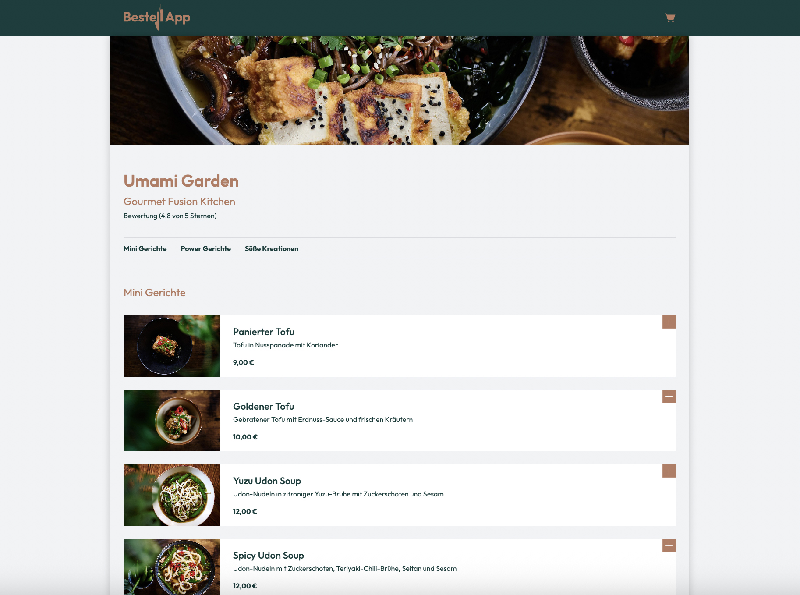
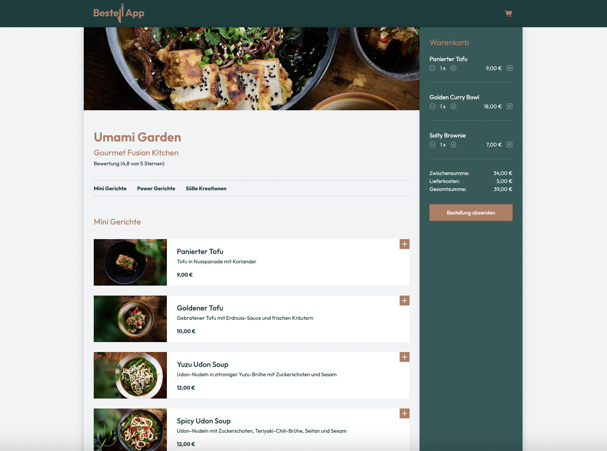
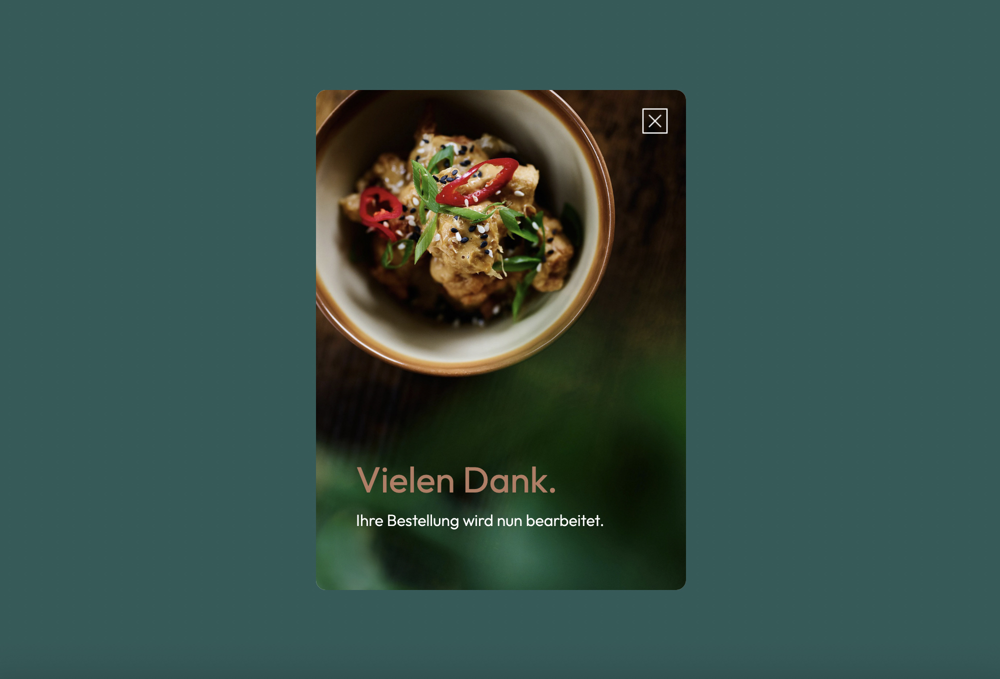

<h1 align="left">Bestell App</h1>

###

This project includes rendering JSONs and arrays, using templates, and correctly transferring data to the basket and local storage. In addition to a visually appealing implementation, it is also important to set the corresponding logic. The app is also optimized for mobile viewing.
   

This project forms part of the Developer Akademie's training programme for software developers (www.developerakademie.com). While I adapted the design to my ideas, other programming specifications from the project had to be fulfilled.  

The logo used is from the Developer Akademie. All other images are from www.pixabay.com. 
Photographers: Joanna Wielgosz / Jean-Louis Servais / Blandine Joannic / Firas Hassoun

 

###

 

 

